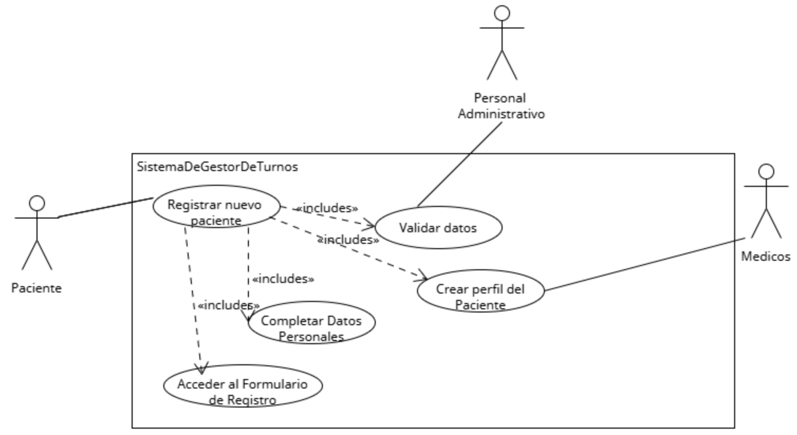
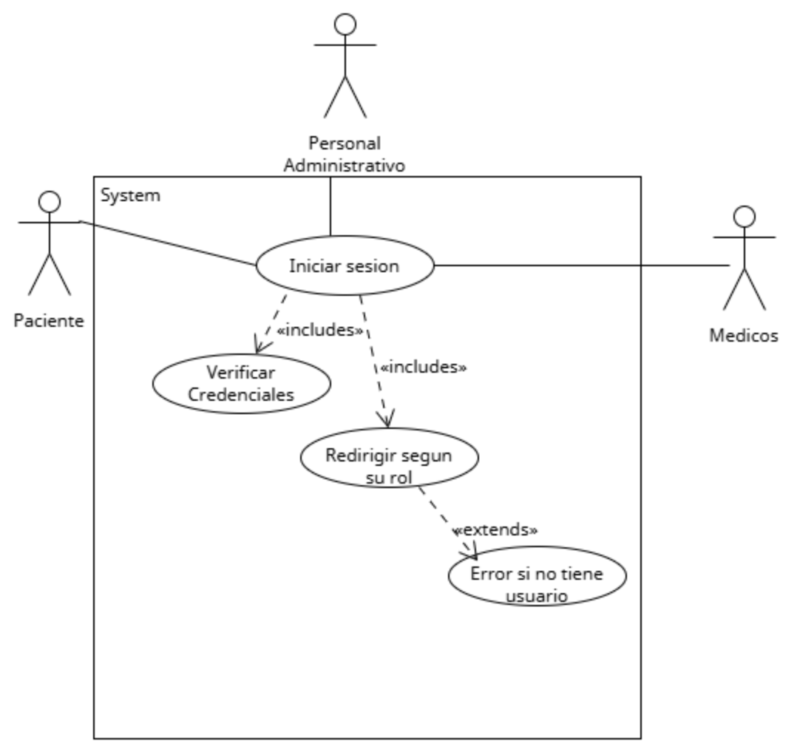
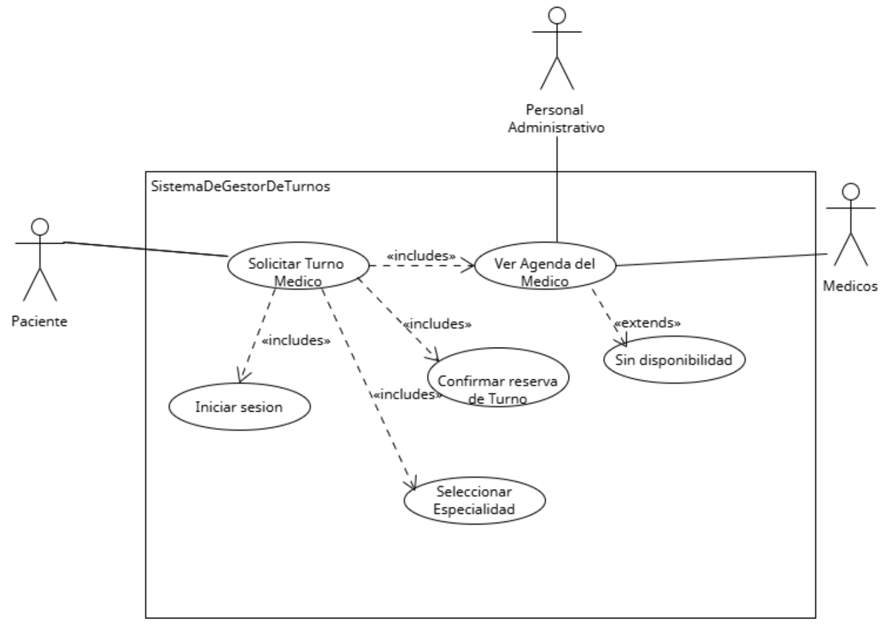
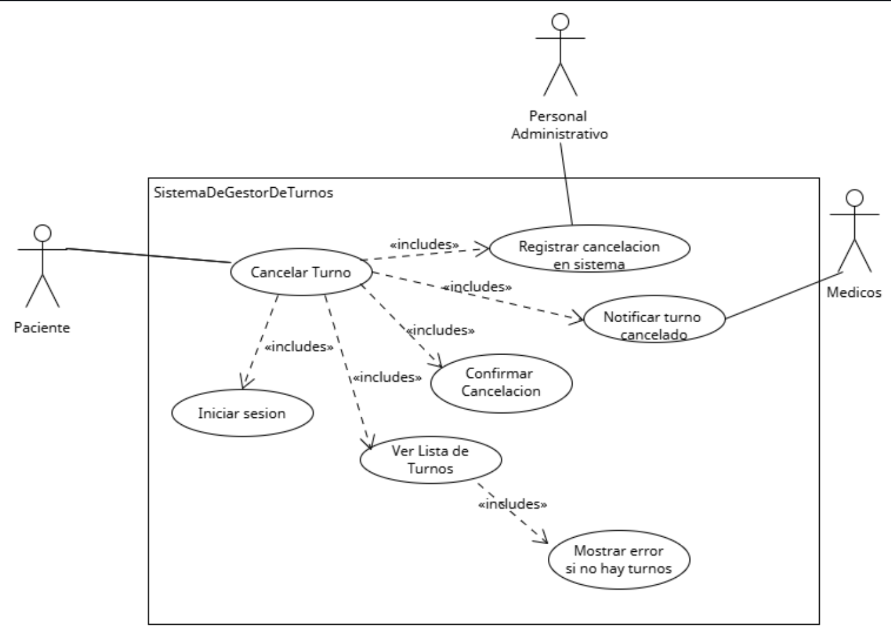
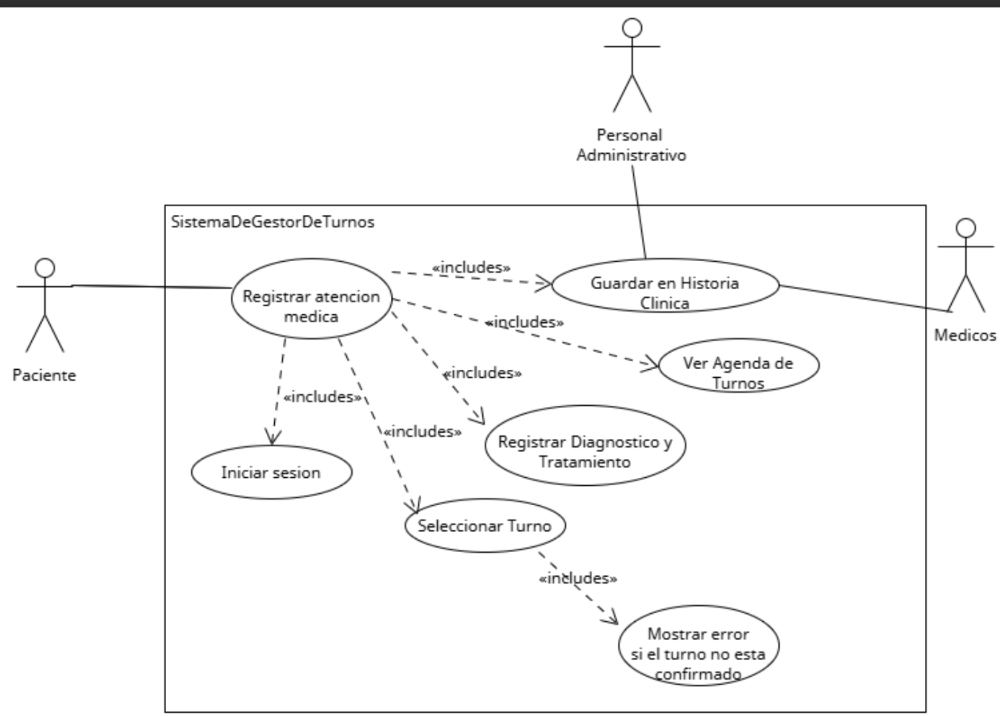

## Diagramas de Casos de Uso

### Diagrama de Casos de Uso 1: Registrar un nuevo paciente
Este caso de uso permite ingresar al sistema los datos personales de un nuevo paciente, como nombre, DNI, contacto y obra social. Es esencial para poder luego asignar turnos médicos y llevar un historial clínico.
  

[Registrar nuevo paciente](https://drive.google.com/file/d/1Y5oF0NpqR2EKgMLjmSWhC2fr9y78s8ai/view?usp=sharing)

### Diagrama de Casos de Uso 2:Iniciar sesion en el sistema
Permite a los usuarios registrados acceder al sistema utilizando sus credenciales, para utilizar las funciones correspondientes a su perfil (pedir turno, consultar agenda, etc.).

* [Iniciar sesion](https://drive.google.com/file/d/1BFE9wVIt7Yly1FJgvhtTCDWOup4udBJF/view?usp=sharing)
  
### Diagrama de Casos de Uso 3:Solicitar Turno Medico
Permite al paciente (o al recepcionista en su nombre) seleccionar un médico, una especialidad y una fecha para agendar un turno. El sistema muestra los horarios disponibles y confirma la reserva del turno.

* [Solicitar turno medico](https://drive.google.com/file/d/11lKhhxh38QjeeOpQclT5jmHWVQVuUd19/view?usp=sharing)

### Diagrama de Casos de Uso 4:Cancelar Turno
Este caso de uso permite al paciente o al personal administrativo cancelar un turno previamente agendado.

* [Cancelar Turno](https://drive.google.com/file/d/1UqcdSCre9mSfUB5p7RG-7urHf1ZuoHtQ/view?usp=sharing)

### Diagrama de Casos de Uso 5: Registrar atencion medica
Una vez que el paciente es atendido, el médico registra en el sistema las observaciones clínicas, diagnóstico y tratamiento.

* [Registrar atencion medica](https://drive.google.com/file/d/1OTtjOVhm-YNWH53e3X_DA3uwjoLdpDhb/view?usp=sharing)

