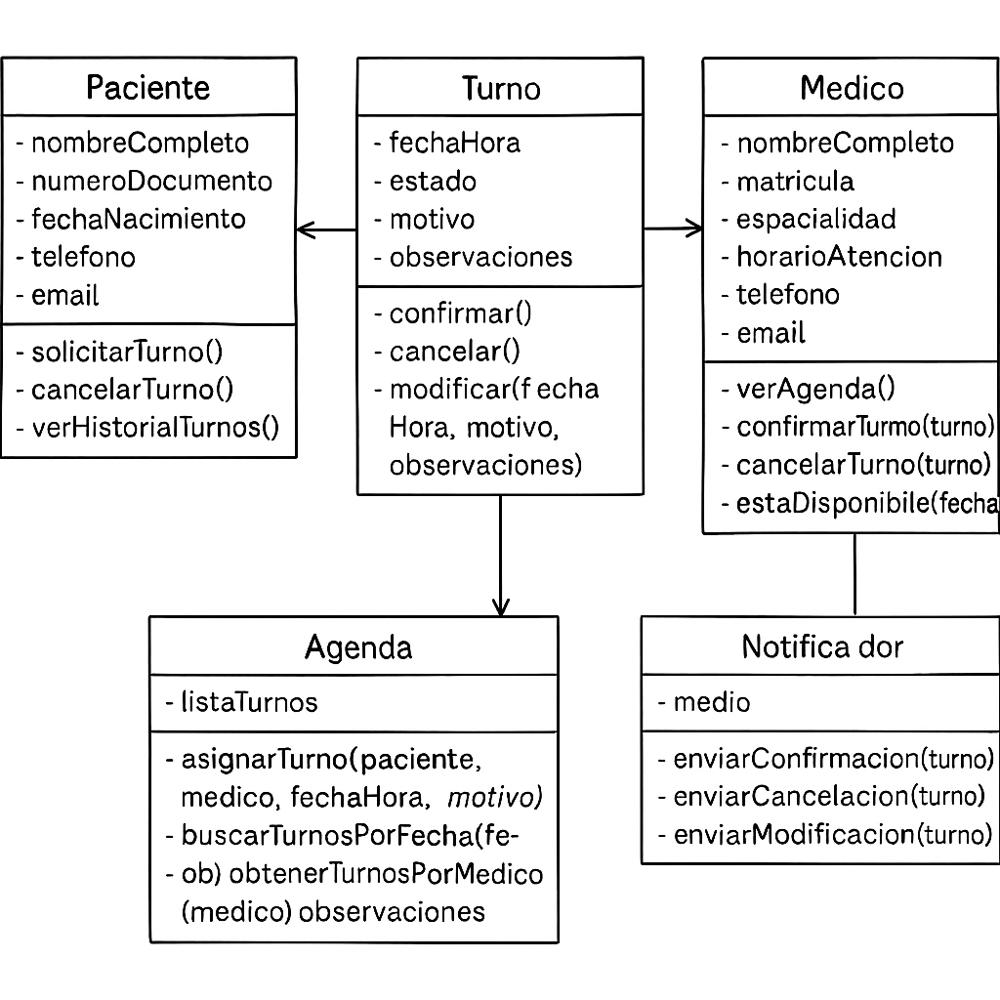

# Introduccion 

 - ¿Que es el Paradigma Orientado a Objetos?

Es un paradigma de programación basado en la organización del código en torno a "objetos" que representan entidades del mundo real. Cada objeto encapsula datos y comportamientos que lo definen y lo hacen interactuar con otros objetos. Este enfoque permite mejorar la reutilización del código, la modularidad y la mantenibilidad de los sistemas.

# Fundamentos de la Programacion Orientada a Objetos

-**Abstracción**

La abstraccion facilita la creación de modelos simplificados de sistemas complejos, enfocándose en los aspectos esenciales. Permite ocultar los detalles internos y presentar una interfaz simple y comprensible.

Ejemplo: 
Un ejemplo clásico es un coche: para conducir, solo necesitas interactuar con el volante, el acelerador y el freno, sin necesidad de entender cómo funciona el motor o la transmisión. 

-**Encapsulamiento**

El encapsulamiento consiste en ocultar los detalles internos de un objeto y exponer solo lo necesario. Solo se pueden modificar o consultar mediante métodos definidos. Esto evita errores y protege la integridad de los datos.

Ejemplo:
Una cuenta bancaria, la cuenta tiene atributos internos como el saldo y el número de cuenta, que son privados y no accesibles directamente desde fuera de la clase. En cambio, se proporciona métodos públicos para depositar, retirar y consultar el saldo. 

  
-**Herencia**

La herencia permite que una clase derive de otra, reutilizando atributos y métodos. Esto permite crear una jerarquía de clases donde las más específicas amplían o especializan a las más generales.

Ejemplo: 
Considera un ejemplo sencillo con clases Animal, Perro y Gato:
Clase Base (Padre): Animal
Clase Hija (Heredada): Perro
Clase Hija (Heredada): Gato

-**Polimorfismo**

El polimorfismo permite que diferentes clases respondan de manera distinta a un mismo método. 

Ejemplo: 
Se puede tener una clase base Animal con un método hacerSonido(). Las clases Perro y Gato podrían heredar de Animal y redefinir el método hacerSonido() para que cada una haga su sonido específico ("Guau!" para Perro y "Miau!" para Gato). De esta forma, al llamar a hacerSonido() en un objeto Animal, el comportamiento actual será el de la subclase específica (Perro o Gato). 

# Requisitos iniciales del sistema

- Registro de usuarios: Permitir el registro de pacientes y profesionales de la salud.

- Gestión de turnos: Gestionar la asignación de turnos según la disponibilidad de los médicos.

- Notificaciones: Enviar notificaciones automáticas sobre cambios en los turnos.

- Historial de turnos: Mantener un historial de turnos de cada paciente y profesional.

- Control de acceso: Proteger la información de contacto mediante acceso restringido.

# Casos de uso
  
### Solicitar Turno

-Actor(es): Paciente

-Descripción breve: El paciente solicita un turno con un médico en una fecha y hora disponible.

-Flujo principal:

 1) El paciente accede al sistema.

 2) Selecciona un médico y visualiza sus horarios disponibles.

 3) Selecciona fecha, hora y motivo.

 4) El sistema registra el turno como pendiente.
    
 5) Se notifica al médico y al paciente.

-Precondiciones: El paciente debe estar registrado en el sistema.

-Postcondiciones: El turno queda agendado en estado pendiente.

### Confirmar turno

-Actor(es): Médico.

-Descripción breve: El médico confirma un turno solicitado por un paciente.

-Flujo principal:

 1) El médico accede a su agenda.

 2) Visualiza los turnos pendientes.
 
 3) Selecciona un turno y lo confirma.

 4) El sistema cambia el estado del turno a “confirmado”.
    
 5) Se notifica al paciente. 

-Precondiciones: El turno debe existir y estar en estado pendiente.

-Postcondiciones: El turno pasa a estado confirmado.

### Cancelar turno

-Actor(es): Paciente o Médico

-Descripción breve: Un turno ya asignado es cancelado por alguna de las partes.

-Flujo principal:

 1) El usuario accede al sistema.

 2) Selecciona el turno que desea cancelar.

 3) El sistema cambia el estado del turno a “cancelado”.

 4) Se notifica a la otra parte involucrada.

-Precondiciones: El turno debe existir.

-Postcondiciones: El turno queda en estado cancelado.

### Registrar usuario (Paciente o Médico)

-Actor(es): Personal Administrativo

-Descripción breve: Un nuevo paciente o médico es cargado en el sistema.

-Flujo principal:

 1) El personal ingresa los datos requeridos (nombre, contacto, etc

 2) El sistema valida la información.

 3) Se almacena el nuevo usuario.

-Precondiciones: El usuario no debe estar ya registrado.

-Postcondiciones: El nuevo usuario queda guardado en el sistema.

### Enviar notificación automática

-Actor(es): Sistema.

-Descripción breve: El sistema envía una notificación al paciente y al médico cuando un turno cambia de estado.

-Flujo principal:

 1) Un turno es confirmado, modificado o cancelado.

 2) El sistema detecta el cambio.

 3) Se genera y envía la notificación a los contactos registrados.

-Precondiciones: Debe haber un cambio en un turno existente.

-Postcondiciones: Los actores involucrados reciben la notificación.

# Boceto Inicial del Diseño de Clases

[Enlace del Boceto](https://drive.google.com/file/d/1iB7omXTPQ9f37ZyAKf93kkn1HpetYByJ/view?usp=sharing)
