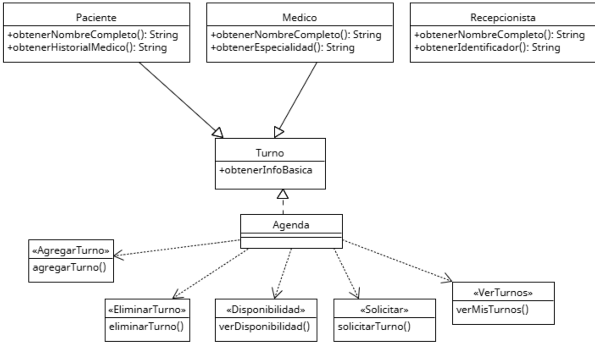

# Principio de Segregación de Interfaces (ISP)
En el sistema de gestión de turnos médicos, había componentes que estaban conectados a estructuras muy grandes que incluían muchas funciones innecesarias. Por ejemplo, ciertos módulos encargados de gestionar los turnos también estaban obligados a incluir funciones relacionadas con reportes estadísticos o configuraciones administrativas, aunque no las necesitaran. Esto hacía que los cambios en funciones no relacionadas afectaran a todo el sistema y aumentaban el riesgo de errores.

El principio ISP propone dividir esas interfaces grandes en partes más pequeñas y específicas, de modo que cada componente del sistema dependa únicamente de lo que realmente necesita. Aplicando este principio, se crearon interfaces más simples y enfocadas, como una para manejo de turnos, otra para notificaciones y otra para reportes.

## Motivacion 

En el sistema de gestión de turnos médicos, uno de los problemas que se detectó fue que ciertos módulos del sistema estaban obligados a depender de funcionalidades que no utilizaban. Por ejemplo, un componente que solo se encargaba de mostrar turnos también tenía que incluir funciones relacionadas con reportes estadísticos, configuración del sistema o administración de usuarios.Este problema se debe a una violación del principio de segregación de interfaces (ISP), que propone que ningún módulo debe estar obligado a depender de métodos que no necesita. Es decir, cada parte del sistema debe contar solo con lo justo y necesario para funcionar.

Para aplicar este principio, se dividieron las grandes estructuras en interfaces más pequeñas y especializadas, enfocadas en tareas concretas. Así, por ejemplo, el módulo de visualización de turnos depende únicamente de una interfaz que contiene funciones de visualización; el módulo de reportes depende de una interfaz que solo maneja reportes, y así sucesivamente. Esto hace que cada parte del sistema sea más sencilla, más estable y más fácil de mantener o modificar sin riesgos innecesarios.

Ejemplo del mundo real: 

Imaginá que una recepcionista solo necesita una lista con los nombres de los pacientes del día y sus horarios. Pero en vez de eso, le entregan un archivo enorme con historiales médicos completos, reportes administrativos y datos contables. No solo es innecesario, sino que hace su trabajo más difícil y aumenta las chances de cometer errores.

En cambio, si solo recibe la información que le corresponde, puede trabajar de forma más rápida, clara y segura. Ese es justamente el objetivo del principio de segregación de interfaces: que cada parte del sistema acceda solo a lo que realmente necesita.

## Estructura de Clases

[ISP](https://drive.google.com/file/d/1eZuJxdsszW-ZRbZB7j36EWNnsREOM0r8/view?usp=sharing)
