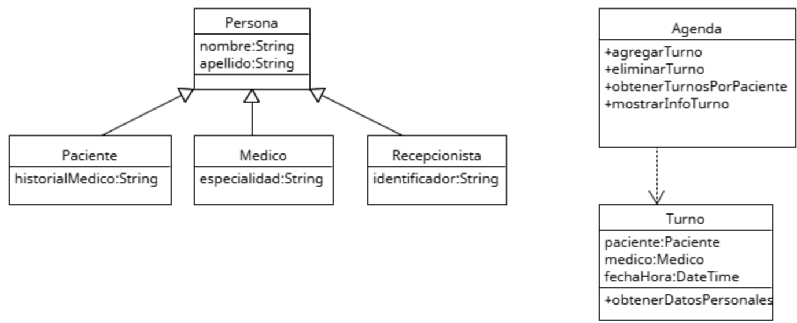

# Principio de Sustitución de Liskov (LSP)
Es un tipo de principio de herencia y sustitución de objetos en programación orientada a objetos,cual su proposito es garantizar que las subclases puedan reemplazar a sus clases
padre sin alterar el comportamiento esperado del sistema.En el sistema de gestión de turnos médicos, se creó una clase base Usuario y varias subclases como Paciente, Médico y Administrador. 
Sin embargo, algunas subclases sobrescribían métodos heredados de forma que rompían la lógica general del sistema. Por ejemplo, si un método esperaba un objeto Usuario y se le pasaba un Administrador,
podía fallar porque este no tenía implementado correctamente un comportamiento esperado, como agendar turnos.

## Motivacion
En el sistema de turnos médicos, todos los usuarios —pacientes, médicos y administradores— estaban agrupados bajo una misma clase general. Esto causaba problemas, porque se asumía que todos podían realizar las mismas acciones, como pedir turnos, cuando en realidad solo los pacientes deberían tener ese permiso.

Para evitar que el sistema fallara o se volviera inconsistente, se agregaban excepciones manuales, lo que lo hacía más complejo y propenso a errores.

El principio de sustitución de Liskov dice que una subclase debe poder reemplazar a su clase base sin alterar el comportamiento del sistema. En este caso, si un Administrador no puede hacer lo que se espera de un Usuario (como pedir turnos), se está violando ese principio.

La solución fue redefinir claramente qué acciones puede realizar cada tipo de usuario. Así, cada uno cumple solo con sus responsabilidades, lo que hace el sistema más claro, seguro y fácil de mantener.

Ejemplo real:
Podría ser en la creación de un programa de gestión de animales. Si se define una clase base Animal con un método volar(), y luego se crea una subclase Pinguino que no puede volar, violaríamos el LSP al no poder sustituir cualquier Animal por un Pinguino sin que el programa deje de funcionar correctamente, ya que volar() no se puede aplicar a un pingüino. 

## Estructura de Clases

[LSP](https://drive.google.com/file/d/1WZScDO7eqKE-_P1BCKp5VaX5jvYs6Hy6/view?usp=sharing)
