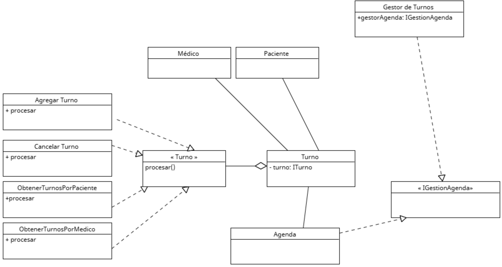

# Principio de Abierto/Cerrado (OCP)

El objetivo principal del Principio de Abierto/Cerrado es permitir que el software sea extensible para nuevas funcionalidades sin necesidad de modificar su código ya existente.
  En el sistema de gestión de turnos médicos, la funcionalidad de notificaciones estaba diseñada de forma rígida. Toda la lógica para enviar correos, mensajes de texto o llamadas estaba dentro de una misma estructura. Cada vez que se necesitaba agregar un nuevo tipo de notificación (como WhatsApp o notificaciones móviles), era necesario modificar directamente el código existente. Esto generaba errores, rompía funcionalidades previas y complicaba el mantenimiento del sistema.

El principio OCP propone que el sistema debe estar abierto para extenderse, pero cerrado para ser modificado. Es decir, debería poder agregarse una nueva funcionalidad (como un nuevo tipo de notificación) sin tocar el código que ya funciona. Para lograrlo, se reorganizó la lógica en componentes independientes, donde cada tipo de notificación tiene su propia estructura. Así, si se quiere añadir otro canal de aviso, se hace como una extensión, sin afectar lo anterior. Esto vuelve al sistema más flexible, seguro y preparado para el cambio.

## Motivacion
En el sistema de gestión de turnos médicos, uno de los problemas más comunes aparecía cuando se necesitaba incorporar nuevas funcionalidades, como agregar distintos tipos de notificaciones para pacientes y médicos. Al principio, el sistema solo enviaba correos electrónicos, pero pronto se quiso sumar mensajes de texto, notificaciones móviles y otros canales.

El inconveniente era que cada vez que se agregaba una nueva forma de notificación, había que modificar el funcionamiento ya existente. Esto traía consigo varios problemas: podían aparecer errores en las funciones que ya estaban probadas, se volvía más difícil realizar pruebas, y el sistema se hacía cada vez más frágil y complejo.

El principio de abierto/cerrado (OCP) propone una solución clara: que los sistemas estén abiertos para ser extendidos, es decir, para agregar nuevas funciones, pero cerrados para su modificación interna. En otras palabras, no hay que tocar lo que ya funciona; en su lugar, se debe añadir lo nuevo como una pieza que se conecta al sistema.

Ejemplo del mundo real

Un ejemplo del mundo real sería el de una máquina expendedora diseñada inicialmente para ofrecer solo tres bebidas. Si cada nueva bebida obliga a reprogramar la lógica principal, mantener el sistema se vuelve complejo. Pero si cada bebida funciona como un módulo independiente,
agregar una nueva es tan simple como conectar una nueva unidad, sin tocar las ya existentes.

## Estructura de Clases

[OCP](https://drive.google.com/drive/folders/1n4uqk2LVsMg0_DCwhau6GO2h1L_wEqLW?hl=es)
