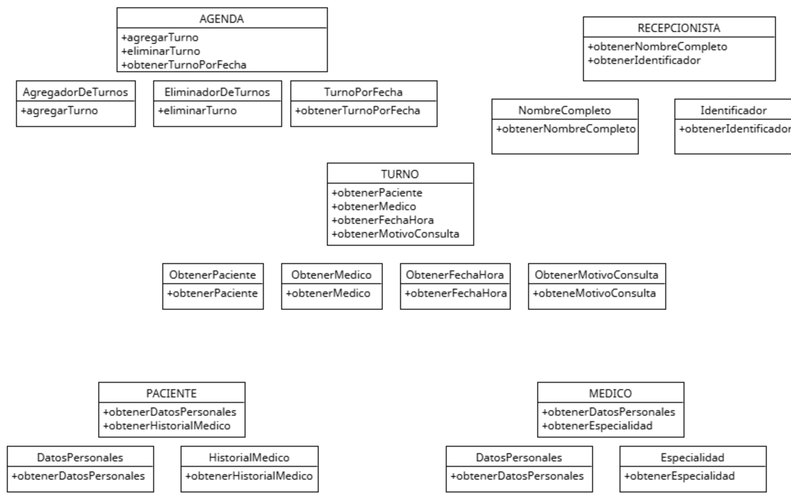

# Principio de Responsabilidad Única (SRP)

El Principio de Responsabilidad Única (Single Responsibility Principle, SRP) tiene como propósito asegurar que una clase tenga una sola razón para cambiar. 
Esto significa que una clase debe tener una única responsabilidad y que todas sus funciones deben estar relacionadas con esa responsabilidad.

En el sistema de gestión de turnos médicos, había componentes que mezclaban varias responsabilidades en una sola unidad. Por ejemplo, una parte del sistema se encargaba al mismo tiempo de gestionar los turnos, validar la disponibilidad médica, notificar al paciente y registrar la información en la base de datos.
El principio de responsabilidad única propone separar esas funciones en partes independientes, donde cada una se ocupe de una sola cosa: una se encarga de crear turnos, otra de validar horarios, otra de enviar notificaciones y otra de guardar la información.

## Motivacion
Uno de los grandes problemas que enfrentaba el sistema de gestión de turnos médicos era que varios componentes realizaban demasiadas tareas a la vez. Por ejemplo, había una única unidad del sistema que al mismo tiempo se encargaba de registrar un nuevo turno, validar si el médico estaba disponible, enviarle la notificación al paciente, y también guardar toda esa información en la base de datos. Esta concentración de funciones en una sola parte del sistema generaba varios inconvenientes: el código era difícil de entender, cualquier cambio afectaba a todo lo demás, y los errores eran más difíciles de localizar y corregir.

Al aplicar este principio en el sistema, se tomó la decisión de dividir esas funciones en componentes separados. Se creó una parte del sistema exclusivamente dedicada a generar turnos, otra que valida disponibilidad, otra que se encarga de enviar notificaciones, y otra que guarda la información. De esta manera, cada módulo se puede desarrollar, modificar o corregir sin afectar a los demás. Esto no solo mejora el orden del sistema, sino que también reduce errores, facilita el mantenimiento y permite escalar el sistema de forma más segura.

Ejemplo del mundo real

Un sistema de gestión de empleados en una aplicación. Cada clase debe tener una única responsabilidad. Por ejemplo, una clase para gestionar la información de los empleados (nombre, puesto, salario, etc.) debería ser distinta de una clase que se encargue de guardar esa información en una base de datos, o de una clase que se encargue de imprimir informes con esa información
## Estructuras de Clases 

[SRP](https://drive.google.com/file/d/1E-nwyAp3TQXZsUNR2Pzokvku0YcNTzUQ/view?usp=sharing)
